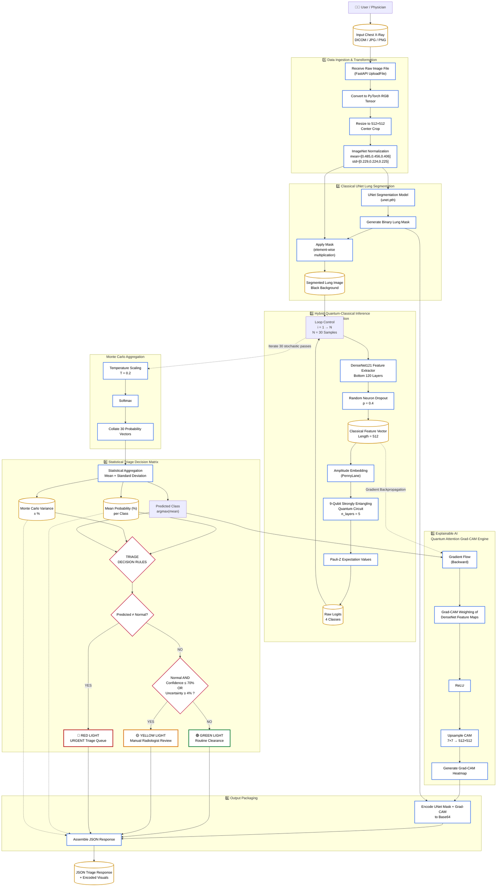

# ⚛️ Hybrid Quantum-Classical Diagnostic System (Case Study)

> **⚠️ Legal Disclaimer:** This project was architected and developed as part of the Unisys Innovation Program (UIP 17). The source code, proprietary datasets, and trained model weights are confidential and belong to Unisys. This repository serves strictly as a technical case study and architectural overview of the system I designed.

## 📌 Executive Summary
Standard AI models in medical imaging act as "black boxes," making them dangerous in clinical environments. This project solves the high-mortality diagnostic overlap between **Tuberculosis and Silicosis** by engineering a highly transparent, multi-stage pipeline. The system leverages classical computer vision for spatial extraction, parameterized quantum layers for complex pattern correlation, and a secondary "Teacher AI" to mathematically audit the primary model's attention in real-time.

## 🏗️ System Architecture

## ⚙️ Core Engineering Modules

### 1. The Pre-Processing Isolation (U-Net)
* **The Problem:** Chest X-rays contain massive amounts of irrelevant noise (clavicles, ribs, pacemakers) that confuse quantum classifiers.
* **The Solution:** Implemented a PyTorch U-Net to mathematically isolate and "shrink-wrap" the lung boundaries, applying a 10-pixel padding margin to preserve edge pathologies while eliminating background noise.

### 2. The Quantum Brain (DenseNet + PennyLane)
* **The Architecture:** Deployed a DenseNet backbone to extract a compressed texture-feature vector, fed into a 9-qubit quantum node via Amplitude Embedding.
* **The Execution:** Utilized Pauli-Z operator expectation values `qml.expval(qml.PauliZ(i))` to collapse the quantum circuit into distinct medical classifications, leveraging quantum entanglement to map highly complex disease correlations.

### 3. The Clinical Triage Algorithm
* **The Problem:** AI models are notoriously overconfident, even when hallucinating. 
* **The Solution:** Engineered a safety-first routing system using Monte Carlo Dropout. By keeping dropout active during inference, the system calculates epistemic variance (standard deviation) across multiple forward passes. High-variance predictions automatically route the patient to a "Yellow" queue for manual human review.

### 4. The Dual-AI Explainability Audit (Faster R-CNN)
* **The Problem:** Doctors cannot trust a Grad-CAM heatmap alone, as it might highlight random background pixels.
* **The Solution:** Trained an independent, two-stage Faster R-CNN "Virtual Radiologist" to generate clinical bounding boxes. The system calculates the Intersection-over-Union (IoU) between the Quantum AI's Grad-CAM hotspot and the Teacher's bounding box in real-time. If the IoU drops below 5% (the Saliency vs. Localization threshold), it flags a "Hallucination Risk."

## 💻 The Practitioner Interface (React & FastAPI)
Built a production-ready Electronic Health Record (EHR) module featuring:
* An asynchronous FastAPI backend to handle deep learning tensors and base64 image generation.
* A secure React.js portal with a 3-panel automated diagnostic viewer (Raw -> U-Net -> Grad-CAM).
* A persistent sidebar logging patient session history, time-stamps, and IoU verification badges for clinical auditing.

## 🛠️ Tech Stack
* **Deep Learning:** PyTorch, Torchvision (DenseNet, U-Net, Faster R-CNN)
* **Quantum Computing:** PennyLane (QML)
* **Computer Vision:** OpenCV, Grad-CAM, IoU Mathematics
* **Backend:** Python, FastAPI, Uvicorn
* **Frontend:** React.js, Tailwind CSS, Lucide Icons
